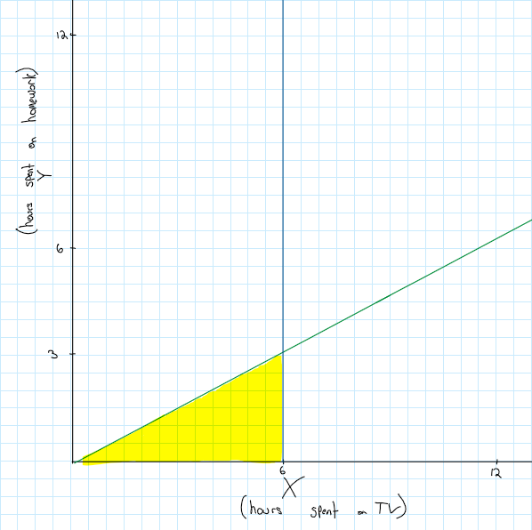

```{r setup, include=FALSE}
knitr::opts_chunk$set(echo = TRUE, fig.width = 4, fig.height = 4)
```

\renewcommand{\sp}{\; \;}
\newcommand*\Eval[3]{\left.#1\right\rvert_{#2}^{#3}}

# Problem 1
## Statement

Let the random variable X be the time in minutes a hungry customer waits to recieve
their tacos at Taco Montes. Suppose X follows an exponential distribution.

a. The *median* time a hungry patron waits to receive their tacos is claimed
to be 12 minutes (i.e., the probability that a patron waits 12 minutes or less
is 0.5, or $\phi_{0.5} = 12$ mins). What is the mean amount of time a hungry patron
waits for their tacos at Taco Montes?

b. Use the MGF ($m_X(t)$), to find the mean wait time a customer waits
to receive a taco — verify that this is the same mean you found in part (a).
*Note: You do not need to derive the MGF of X, you may use the appropriate mgf provided in notes or text* 

c. Consider 15 independent Taco Montes customers. Let the RV Y be the number
of hungry customers who wait more than 12 minutes to receive their tacos.

    i.  Provide an appropriate probability distribution for modeling Y 
    (i.e., specify $Y \sim$ DistributionName(appropriate parameter(s) and their values)).
    
    ii. Write a probability statement, and a mathematical expression for the probability 
    that more than 12 of the customers wait longer than 12 minutes to receive their tacos. 
    *You do not have to evaluate the expression.*
    
    iii. Use R to calculte the probability in ii. and share the code you used to answer the question
    
    iv. **Extra Credit** Imagine an infinite line of people waiting for tacos, 
    and define the customer place in line by 1 (first in line), 2 (second in line), 3 (third in line), etc.
    Let Z be the place in line for which this particular customer is the 5th who waits more than 12 minutes to get their tacos.
    Provide a reasonable distribution for modeling Z, and find $P(Z > 10)$ — you may use R, but share your code.

\hrule
## Solution


a. So we know that $\phi_{0.5} = 12 \implies F(12) = 0.5$. So we can solve for the parameter $\beta$

\begin{align*}
F(x) = 0.5 &= \int_{0.5}^{12} \frac{1}{\beta} e^{-x/\beta}\\
&= \Eval{- e^{-x/\beta}}{0}{12}\\
0.5 &= 1 - e^{-12/\beta}\\
e^{-12/\beta} &= 0.5 \\
-12/\beta &= \ln(0.5)\\
\beta &= -12/\ln(0.5) = 17.31
\end{align*}

We know that the expected value (mean) of an exponential distribution is $\beta$
so the mean wait time of a Taco Montes customer is 17.31 minutes.

We can also verify that this is the right beta value by using it to compute the median:

```{R}
b <- -12/log(0.5)
qexp(p = 0.5, rate = 1/b)
```


b. We know that the MGF of an exponential distribution is $m_x(t) = (1-\beta t)^-1$.
We also know that $E(X) = \frac{d}{dt} \Eval{m_X(t)}{t = 0}{}$ and we computed $\beta = 17.31$ in the last problem
So, $E(X) = \Eval{\frac{\beta}{(1- \beta t)^2}}{t= 0}{} = \beta = 17.31$ minutes which is the same as we computed in a.

c. 

    i. So this is a yes-no scenario: did they wait more than 12 minutes yes or no. And we are counting the number of
    'yes' responses. So this is essentially a coin-flip scenario, so it is binomial.
    We know that $\phi_{0.5} = 12$ so half the customers wait more than 12 minutes.
    So $p = 0.5$ and there are $15$ customers, so $n = 15$.
    So $Y \sim Binomial(n = 15, p = 0.5)$
    
    ii. We are looking for $P(Y \geq 12) = 1 - P(Y < 12) = 1 - P(Y \leq 11)$ where the last simplification
    follows from $Y$ being discrete. We can write this mathematically as:
    $$P(Y \geq 12) = 1 - \sum_{y = 1}^{11} {15 \choose y}*0.5^y*0.5^{15-y} = 1 - 0.5^{15} \sum_{y = 1}^{11} {15 \choose y} $$
    Where the value inside the summation is the pdf of a binomial distribution of $n = 15, p = 0.5$
    
    iii. To compute this we can use the pbinom function
    
    ```{R}
    ans <- 1 - pbinom(q = 11, prob = 0.5, size = 15)
    ans
    ```
    
    iv. TODO


# Problem 2
## Statement
Suppose two people are waiting in the same line at the grocery store (i.e.,
they will be checked out by the same cashier). Let X be the time at which the first
person in line pays for their items and let Y be the time at which the second person
in line pays for their items. Note that these random variables represent the time
of payment, not the time spent in line. The joint distribution of X and Y is given
by
$$
f_{X,Y}(x,y) = \begin{cases}
\lambda^2e^{-\lambda y} & ? \\
0 & otherwise
\end{cases}
$$

*Without doing any calculations*, choose the support that you belive would be reasonable for this situation
and *thouroughly explain your reasoning*.

\begin{center}
(a) $0 < x < \infty, \sp 0 < y < \infty$ \quad (b) $0 < x < y < \infty$ \quad (c) $0 < y < x < \infty$ \quad (d) $0 < y < \infty$
\end{center}

\hrule
## Solution

The most reasonable solution is (b) $0 < x < y < \infty$. Since they are waiting in the same line,
the first person in line should be checked out first person in line (the person corresponding to the variable $X$)
would be checked out first. So the first person is checked out before the second $\implies x < y$.
Then they cannot be checked out in negative time so $x, y > 0$. But it is possible that the cashier is 
extremely slow, so it could take any amount of time until they actually get checked out. 
So the most we can say is they will eventually be checked out (10 minutes, next week, next millenium we don't know)
so $x, y < \infty$. Thus combining this we get $0 < x < y < \infty$. 

We can also use these assumptions to rule out the other options. (a) does not account for
$x < y$ so the second person in line could be checked out before the first which doesn't happen (no cutting in line.
(c) says that the second person must be checked out before the first which also doesn't happen (no cutting in line).
(d) says nothing about $x$ so $x$ could be checked out absolutly whenever, including negative time and $-\infty$ which
makes no sense. So it must be (b)

# Problem 3
## Statement

Suppose the daily number of hours, X, a teenager watches television, and
the daily number of hours, Y, they spend on homework can be modeled with the joint pdf

$$f_{X,Y}(x,y) = \begin{cases}
xye^{-(x+y)} & x > 0, y > 0\\
0 & otherwise
\end{cases}$$

a. Are $X, Y$ independent? Why or why not?

b. Given what $X$ and $Y$ represent, does your answer in (a) seem realistic? Explain

c. What is the probability that a teenager spends less than half the time 
doing homework than they do watching television, but less than six hours
watching television? Provide the final integral for finding this probability, but
DO NOT actually evaluate the integral. *For full credit, Include a well-labeled 
picture of the support and the region of integration of interest!*

\hrule
## Solution


a. Yes they are independent. The supports factor into a rectangle that is the first quadrant in $\mathbb{R}^2$
The pmf can be factored into $g(x) = xe^{-x}$ and $h(y) = ye^{-y}$. So we show it factors:
$g(x)h(y) = xe^{-x}ye^{-y} = xy e^{-x - y} = xy e^{-(x + y)} = f_{X,Y}(x,y)$
Then by factorization theorem X independent of Y.

b. No this doesn't make sense. With this model they can spend 15 hrs watching TV and another 15 doing homework.
This doesn't make sense since the last time I checked there were only 24 hours in a day.
So physically $x + y \leq 24$ is how it should be (this would not have a rectangular domain and thus not independent).
X and Y are mutually exclusive you can't be doing both at once so they can't be independent
since one affects how much of the other you can do.

c. 
{width=50%}

So we are integrating over the region shown in figure 1. So we have
$$P(Y < 1/2X, X < 6) = \int_0^6 \int_0^{1/2x} xye^{-(x + y)} dy dx$$


# Problem 4
## Statement
Let X represent the time in years until a randomly selected watch quits
working and let Y represent the amount of measurement error for a watch in minutes
(i.e., the amount of time, in minutes, a watch is off from the exact time). Assume
the two random variables are statistically independent (even though this may not be realistic).
Suppose $X \sim Exponential(\beta = 2)$ and $Y \sim Uniform(-1, 1)$


a. Give the joint distribution $f_{X, Y}(x,y)$

b. Find, $F_{X, Y}(x,y)$ *Be sure to include ALL regions of interest*

c. **Extra Credit** Find $E(Y^2X^3)$

\hrule
## Solution


# Problem 5
## Statement

A three parameter gamma distribution can be defined by incorporating a 'location'
parameter shift to the distribution with pdf

$$f(x) = \frac{1}{\Gamma(\alpha)\beta}\left(\frac{x- r}{\beta}\right)^{\alpha - 1} e ^{-(x-r)/\beta} I _{r, \infty}(x)$$

What are the restrictions on the paramters, $\alpha, \beta,$ and $r$?
Clearly explain your reasoning for each parameter
